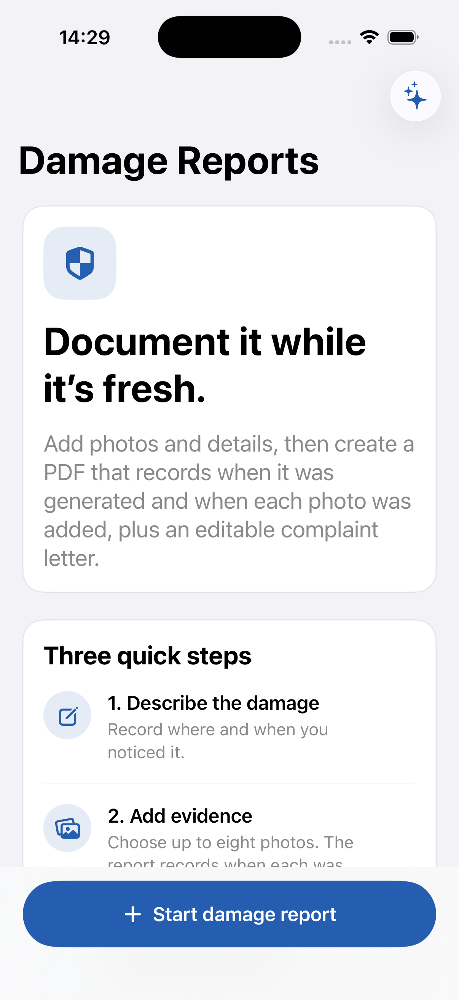
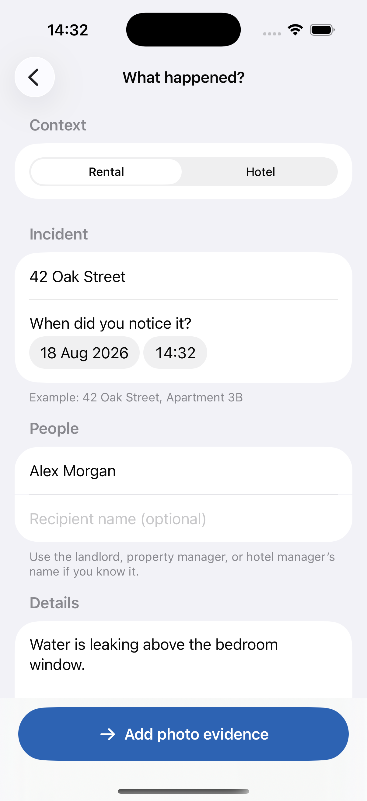
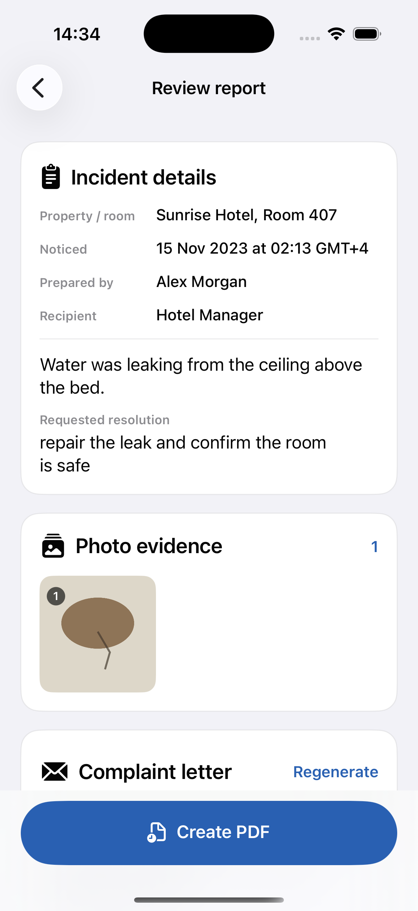
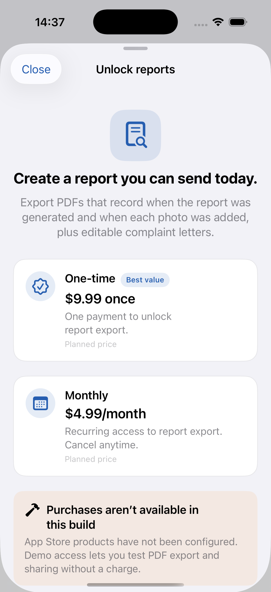

# Damage Report Maker

### First-draft product review · 18 August 2026

> Turn incident details and photo evidence into an organized PDF report and an editable complaint letter—without uploading the report content.

**Current verdict:** the core experience is complete enough for demos and internal testing. The remaining work is concentrated in commerce, App Store compliance, distribution, and production hardening.

---

## Product at a glance

- **Audience:** renters and hotel guests documenting property damage.
- **Core job:** collect the facts and photos while the incident is fresh.
- **Output:** a structured Letter/A4 PDF plus an editable complaint letter.
- **Privacy posture:** report details and normalized photos remain on the device unless the user chooses a share destination.
- **Planned pricing:** **$9.99 once** or **$4.99/month**. Purchases are clearly marked as unavailable in this prototype.

---

## App walkthrough

<table>
  <tr>
    <td align="center" width="50%">
       
      <strong>1. Start quickly</strong> 
      A focused landing screen explains the three-step workflow and keeps the primary action visible.
    </td>
    <td align="center" width="50%">
       
      <strong>2. Record the facts</strong> 
      Rental/hotel context, property, incident time, people, description, and requested resolution.
    </td>
  </tr>
  <tr>
    <td align="center" width="50%">
       
      <strong>3. Review the report</strong> 
      Confirm the summary, inspect photo evidence, edit the letter, and create the PDF.
    </td>
    <td align="center" width="50%">
       
      <strong>4. Clear prototype pricing</strong> 
      Both planned offers are visible, while the screen honestly states that StoreKit purchases are not configured yet.
    </td>
  </tr>
</table>

---

## Functionality review

| Area | Status | Review |
| --- | --- | --- |
| Guided workflow | ✅ Working | A simple `Details → Evidence → Review` flow supports both rentals and hotels. Required fields and sensible input limits prevent incomplete reports. |
| Photo evidence | ✅ Working | Imports up to eight ordered images, downscales them off the main UI path, supports captions and removal, and handles cancellation/import failures. |
| Timestamps | ✅ Honest scope | The app records report-generation time and when each photo was added using the device clock. It does **not** claim original capture time or independent verification. |
| Draft safety | ✅ Working | Unfinished drafts autosave locally and restore after relaunch. Destructive actions ask for confirmation. |
| Complaint letter | ✅ Working | Generated locally with no AI/network dependency, remains editable, and detects when source details have changed without silently overwriting user edits. |
| PDF report | ✅ Working | Produces Letter/A4 output with metadata, cover details, paginated long text, page numbering, one evidence page per photo, preview, sharing, and old-export cleanup. |
| Pricing | 🟡 Prototype | The requested prices are presented, but `demoAccessEnabled` is only a test gate. No real purchase or entitlement exists yet. |
| Accessibility | 🟢 Good foundation | System typography/colors, Dynamic Type fallbacks, labeled evidence controls, and 44-point action targets are present; a full assistive-technology audit remains. |

### Quality evidence

- Simulator build completed successfully.
- **12 automated tests passed:** 9 unit tests and 3 end-to-end UI tests.
- Tests cover required details, letter generation and stale-edit protection, pricing disclosure, report creation, PDF cleanup, and maximum-length PDF pagination without lost tail content.
- Light mode, dark mode, large accessibility text, and the rendered three-page PDF were visually reviewed.

---

## What remains for production

### 1. Replace demo access with StoreKit

- Create the non-consumable and/or subscription products in App Store Connect.
- Load localized product names and prices instead of hard-coded display values.
- Implement verified transactions, entitlement refresh, pending/refund/expiry handling, and **Restore Purchases**.
- Decide what ongoing value differentiates the monthly plan; otherwise launch with the one-time unlock only.
- Add StoreKit configuration, sandbox, and TestFlight purchase tests.

Reference: [StoreKit 2](https://developer.apple.com/storekit/) and [In-App Purchase documentation](https://developer.apple.com/documentation/storekit/in-app-purchase).

### 2. Finish privacy and release compliance

- Add `PrivacyInfo.xcprivacy` and declare the approved reason for app-only `UserDefaults` access.
- Publish an accessible privacy policy covering local storage, sharing, retention, and deletion.
- Complete App Store privacy answers and add privacy/support links inside the app and listing.
- Preserve the current wording that these are device-clock timestamps, not authenticated chain-of-custody evidence.

Reference: [privacy manifest files](https://developer.apple.com/documentation/bundleresources/privacy-manifest-files), [required-reason APIs](https://developer.apple.com/documentation/bundleresources/describing-use-of-required-reason-api), and [App privacy details](https://developer.apple.com/app-store/app-privacy-details/).

### 3. Prepare signing and distribution

- Select the Apple Developer team and create the App Store Connect app record.
- Archive and validate a release build, add store metadata/screenshots/review notes, and run an internal TestFlight beta.
- Confirm the final bundle identifier, versioning, support URL, privacy URL, age rating, category, and regional availability.

Reference: [TestFlight](https://developer.apple.com/testflight/) and the [App Store Connect workflow](https://developer.apple.com/help/app-store-connect/get-started/app-store-connect-workflow).

### 4. Harden data handling and QA

- Apply explicit file protection and a backup policy to saved drafts; add a visible delete-draft/data action and persistence migrations.
- Profile PDF creation and eight-photo drafts on real devices, especially under low-memory and low-storage conditions.
- Expand coverage for real PhotosPicker/iCloud failures, interrupted saves, sharing/Quick Look, all StoreKit states, VoiceOver/Switch Control, locales/time zones, image orientations, and iOS 17 through current releases.
- Run a small renter/hotel usability beta and refine the letter wording with appropriate legal review before marketing it as formal evidence.

---

## Recommended path to launch

1. **Choose the launch offer** and implement StoreKit entitlements.
2. **Complete privacy, data-lifecycle, signing, and App Store setup.**
3. **Run real-device and TestFlight validation** across the critical report/export flows.
4. **Ship a narrow v1** once purchases, compliance, and release QA are green.

The end-to-end reporting experience does not need to be rebuilt. Production work is primarily about making the existing core safe to sell, support, and distribute.
